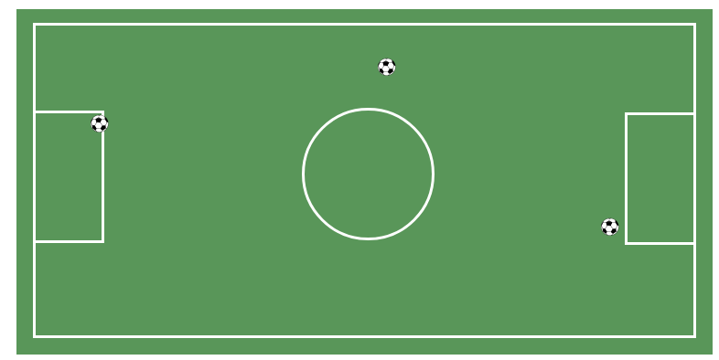

## **La Cancha**  
#### Es un programa que nos muestra la imagen de una cancha de fútbol contruida con ayuda de la propiedad *position* de CSS.

#### En la imagen podemos observar un fondo rectangular verde el cual contiene un marco blanco, dos porterias de borde blanco, el centro y 3 pelotas de fútbol ; todos estos elemntos fueron construidos a partir de una etiqueta *div* en nuestro archivo Html.
#### A todos los elements mencionados; a excepción del fondo rectangular, se les modificó el valor de la propiedad *position* dando como nuevo valor *relative* para poder desplazarlos a través del fondo principal(rectangulo verde más grande) cambiando la nueva posición de sus coordenadas con las propiedades : left,top,bottom.